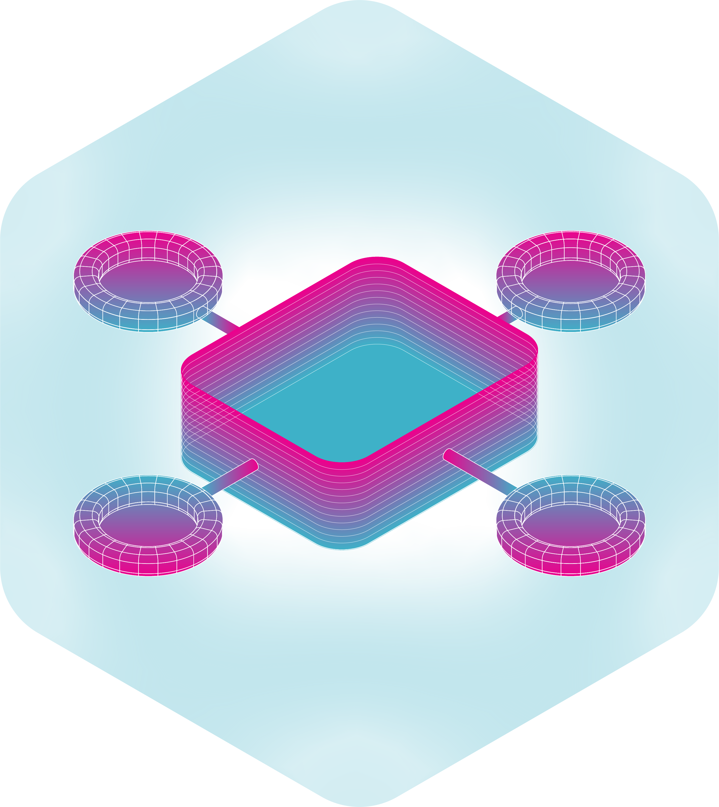

# DreamDrone 

> "... The simulacrum is never that which conceals the truth -- it is the truth which conceals that there is none. The simulacrum is true."
>
> ---- Jean Baudrillard

Computational modeling enables us to simulate and observe emergent cognitive phenomena in humans and machines. It helps us turn intangible theories of psychophysical and information processes into something tangible, allowing us to study human behaviors in ways that are mathematically representable and abstractable. In so doing, it enriches the understanding of our interaction with our surrounding environments and with each other. 

Here at DreamDrone, we are interested in simulating machines that are flown by humans: in both real world and virtual; flown in solo and together; with sights and with sounds. Come fly with us. Let's fly, let's fly away!

## Bayesian hierarchical modeling of trajectory-dependent gaze behaviors in multi-waypoint virtual drone steering

we investigate the relationship between waypoint position and gaze behaviors in virtual drone steering. We construct a hierarchical Bayesian linear regression model that allows us to examine gaze behavior with some baseline consideration of individual differences. Through this model, we would be able to estimate and predict gaze behavior based upon relative waypoint positions.